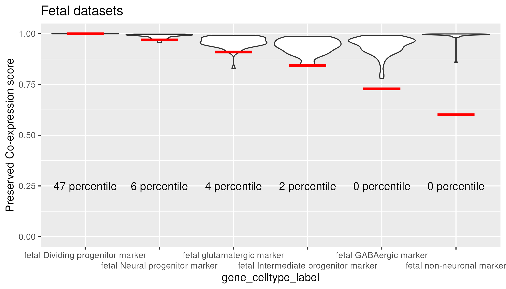
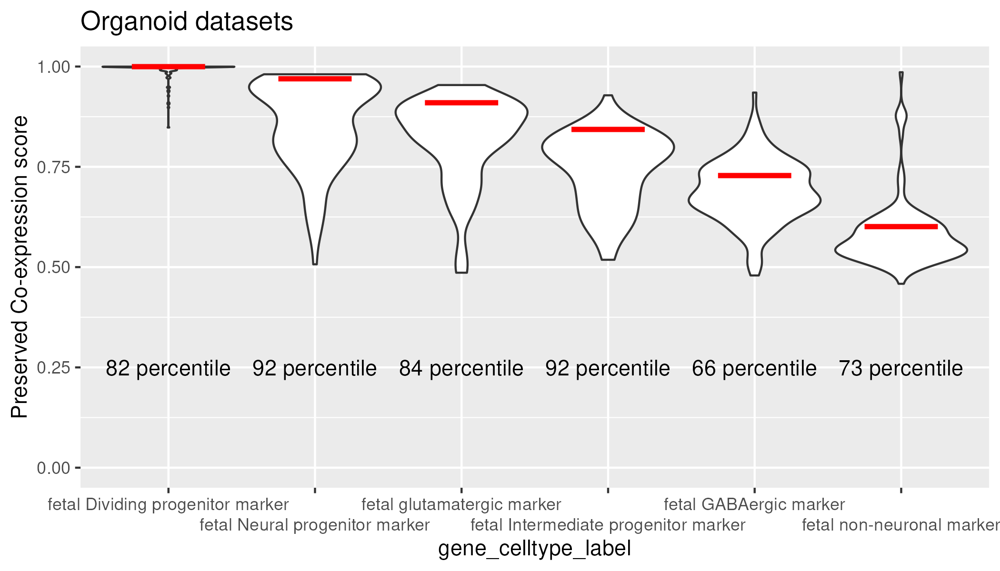

<!-- README.md is generated from README.Rmd. Please edit that file -->

# preservedCoexp

<!-- badges: start -->

<!-- badges: end -->

preservedCoexp is an R package that quantifies the strength of preserved
co-expression at the gene-level across two co-expression networks. It
was originally designed to compute preserved co-expression between human
fetal brain and human neural organoid co-expression networks, as
implemented in [Werner and
Gillis 2023](https://doi.org/10.1101/2023.03.31.535112) . The package
provides functions to compute co-expression networks from a
gene-by-sample expression matrix. The package also provides
meta-analytic fetal cell-type markers and an aggregated fetal
co-expression network as data for users to compute preserved
co-expression within their own organoid co-expression networks.

## Installation and software requirements

The preservedCoexp package was developed using R v4.2.2 and python
v3.6.8

This package can be run using a standard laptop; a MacBook Pro M2 with
16GB of RAM and a high memory server with 188GB RAM were used in
testing. Examples of timing for computing co-expression networks and
quantifying preserved co-expression are included in Figure 6 of [Werner
and Gillis 2023](https://doi.org/10.1101/2023.03.31.535112). A
single-cell dataset of 40,000 cells took under 10 minutes for analysis
on the MacBook and a dataset of 100,000 cells took under 6 minutes for
analysis on the high-memory server.

You can install the development version of preservedCoexp from
[GitHub](https://github.com/) with:

``` r
if (!requireNamespace("devtools", quietly = TRUE))
    install.packages("devtools")
devtools::install_github("JonathanMWerner/preservedCoexp")
```

## A note on dependencies

We employ a python script to increase the speed of computing
co-expression matrices. Users will need to install python3 and the
following 3 python packages to use the preservedCoexp package.
Additionally, if running on an Apple machine, users should install the
arm64 architecture of R to ensure R and python can interact properly.

``` r
python3 -m pip install numpy
python3 -m pip install pandas
python3 -m pip install scipy
```

The GO.db R dependency can be installed as follows:

``` r
if (!requireNamespace("BiocManager", quietly = TRUE))
    install.packages("BiocManager")
BiocManager::install("GO.db")

```

## Beginning analysis

preservedCoexp takes as input a normalized gene-by-sample expression
matrix, this is the exp\_data object in the code below. We recommend CPM
normalization. This package was originally designed to work with
single-cell expression data, but a bulk gene-by-sample expression matrix
would work as well.

``` r
library(preservedCoexp)
data('go_genes', package = 'preservedCoexp')             #List of GO gene annotations

#Functions to compute a rank standardized co-expression network, where exp_data is a normalized gene-by-sample expression matrix provided by the user
exp_data_GO = fit_to_GO(exp_data)              #Fit to GO gene annotations
rank_mat = get_spearman(exp_data_GO)           #Get co-expression matrix
rank_mat = rank_coexpression(rank_mat)        #Get rank standardized co-expression matrix
```

## Preserved co-expression

Our measure of preserved co-expression quantifies the degree to which
the top 10 co-expressed partners of a gene are shared between two
co-expression networks, one reference and one test network. We use the
auroc statistic, so for a single gene with an auroc of 1, the top 10
co-expressed partners for that gene across the two networks are exactly
the same. An auroc close to 0.5 shows there is no signal, the top 10
co-expressed partners are randomly distributed in the test network. An
auroc of exactly 0.5 represents a gene with 0 expression in the test
network.

We provide our aggregate fetal brain co-expression network to act as the
reference network when quantifying preserved co-expression. You can
compute the preserved co-expression of individual genes or of gene sets.
We use the average preserved co-expression auroc across genes for the
preserved co-expression score of that gene set.

First load into memory the aggregate fetal co-expression network and
then explore preserved co-expression scores of genes or gene sets.

``` r

#If you get a timeout error when loading the aggregated co-expression network, try setting options(timeout=900) to allow longer time for download.
aggregated_fetal_network = load_fetal_coexp()

#You can also download the adult brain co-expression network
adult_network = load_adult_coexp()


#Get the preserved co-expression auroc of a single gene, in this case the first gene in the go_genes gene list
get_gene_preserved_coexp(aggregated_fetal_network, rank_mat, go_genes[1])


#Get the preserved co-expression score of a gene set. We highly recommend setting parallel = T if you work on a multi-core computer to increase speed. 
#For systems with only a few cores (Macbook Pro 8-core), parallel = T may actually be slower, so user's should keep the defualt value. 
get_geneset_preserved_score(aggregated_fetal_network,rank_mat, go_genes[1:10], parallel = T)


#This will return a named vector of preserved co-expression aurocs for all genes in the gene set
get_geneset_preserved_coexp(aggregated_fetal_network,rank_mat, go_genes[1:10], parallel = T)
```

You can also compute the preserved co-expression of our fetal brain
MetaMarkers for the 6 broad cell-types we analyze in Werner and Gillis
(citation).

``` r
#Load the fetal MetaMarkers
data('fetal_meta_markers', package = 'preservedCoexp')


#Get the preserved co-expression aurocs for the top 10 MetaMarkers from the 6 broad fetal cell-types
get_metaMarker_preserved_coexp(aggregated_fetal_network, rank_mat, fetal_meta_markers, celltype = 'Neural_Progenitor', num_markers = 10, parallel = T)
get_metaMarker_preserved_coexp(aggregated_fetal_network, rank_mat, fetal_meta_markers, celltype = 'Dividing_Progenitor', num_markers = 10, parallel = T)
get_metaMarker_preserved_coexp(aggregated_fetal_network, rank_mat, fetal_meta_markers, celltype = 'Intermediate_Progenitor', num_markers = 10, parallel = T)
get_metaMarker_preserved_coexp(aggregated_fetal_network, rank_mat, fetal_meta_markers, celltype = 'GABAergic', num_markers = 10, parallel = T)
get_metaMarker_preserved_coexp(aggregated_fetal_network, rank_mat, fetal_meta_markers, celltype = 'Glutamatergic', num_markers = 10, parallel = T)
get_metaMarker_preserved_coexp(aggregated_fetal_network, rank_mat, fetal_meta_markers, celltype = 'Non-neuronal', num_markers = 10, parallel = T)
```

Additionally, you can explore preserved co-expression scores of GO
terms. We provide a p-value computation for each GO term based on a mean
sample error approach. The left-sided p-value represents the
significance of GO terms that do not preserve co-expression and the
right-sided p-value is the significance GO terms do preserve
co-expression. We recommend filtering for GO terms with between 10-500
genes.

``` r
library(GO.db)
GO_descriptions = as.list(GOTERM)
data('BP_GO_mat', package = 'preservedCoexp')         #A matrix containing gene and GO term relationships

#This returns an ordered dataframe of GO terms, ordered by their FDR-adjusted p-value.
BP_GO_results = get_GO_term_scores(aggregated_fetal_network, rank_mat, BP_GO_mat, parallel = T)
```

## Fetal and Organoid meta-analysis

We provide the results of our meta-analysis computing the preserved
co-expression of 51 fetal and 124 organoid single-cell RNA-sequencing
datasets. The following functions calculate the preserved co-expression
scores of the top 100 MetaMarkers per cell-type The red line indicates
the percentile of the user’s co-expression network in either the fetal
or organoid score distributions.

``` r
data('fetal_meta_markers', package = 'preservedCoexp')   #Dataframe of fetal MetaMarkers 
data('meta_presCoexp_df', package = 'preservedCoexp')
plot_results = plot_meta_results(aggregated_fetal_network, rank_mat, fetal_meta_markers, meta_presCoexp_df, parallel = T)
plot_results[[2]]
plot_results[[3]]
```



